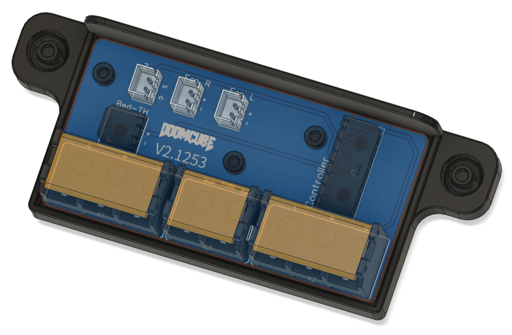
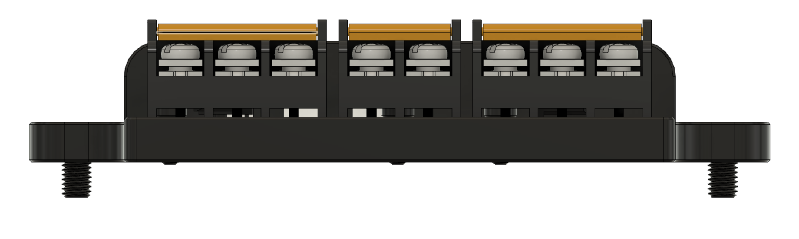

# Heated Bed PCB

This MOD consists of a PCB and Mount to tidy up the cabling at the back of the heated bed.
The mount can be mounted between the bed frame on top of the bottom frame extrusion and will not interfere with any of the purge buckets.

## WARNING
**You are connecting Mains wiring with high voltages to the PCB. You can die if you don't understand what you are doing. If you are not familiar with electronics, please ask a professional for assistance. I will not be accountable for any damages, injuries or fatalities.**

That being said, the PCB was designed with the following specs:
- Mains traces are 3.560mm wide. That is sufficiant for a max thermal increase of 10 degrees at an ambiant temperature of 70 degrees Celcius at 10A current.
- Other traces are 0.763mm wide.
- There is a Mains Ground copper pour on both sides of the PCB for safety.

The PCB has connections for:
- Mains from the electronics compartment
- Mains from the heater
- Bed Thermistor
- Z-Endstop
- 2 Fans (for instance for a nevermore micro or a regular bed fan. I'm using 2 Nevermore Micro's on both sides of the bed myself.
- 7 pin Molex Microfit 3.0 connector for the wire bundle to the controller board

## Hardware
Part|QTY
|:---:|:---:|
M3x6 SHCS or BHCS|3
M3x5x4 heatset insert (standard Voron)|3
M5x10 BHCS|2
M5 T-nut or roll-in|2
JST B2B-XH|3
Molex Microfit 3.0 436500200|1
Molex Microfit 3.0 436500200|1
HB-9500 terminal block 2 pin|1
HB-9500 terminal block 3 pin|2

## Connections
The silk layer on the PCB shows all connections, except for the 7 pin connector. 
The connections are (from back of the mount to front (towards Mains connectors):

Pin|Type|Use|Connection Controller Board
|:---:|:---:|:---:|:---:|
1|GND|Provides GND for Z-Endstop|Connect to GND on Z-Endstop connector
2|AGND|Provides seperated Analogue GND for BedTh to prevent noise|Connect to Bed Thermistor connector (polarity does not matter)
3|BedTh|Bed Thermistor|Connect to Bed Thermistor connector (polarity does not matter)
4|Z-Endstop|Provides Signal for Z-Endstop|Connect to Signal on Z-Endstop connector
5|Fan Right|Provides GND for Right Fan|Connect to GND on a free 24V Fan connector
6|24V|Provides 24V for both Left and Right Fan|Connect to 24V on a free 24V fan connector (can be same connector as used for Left or Right Fan GND)
7|Fan Left|Provides GND for Left Fan|Connect to GND on a free 24V Fan connector
